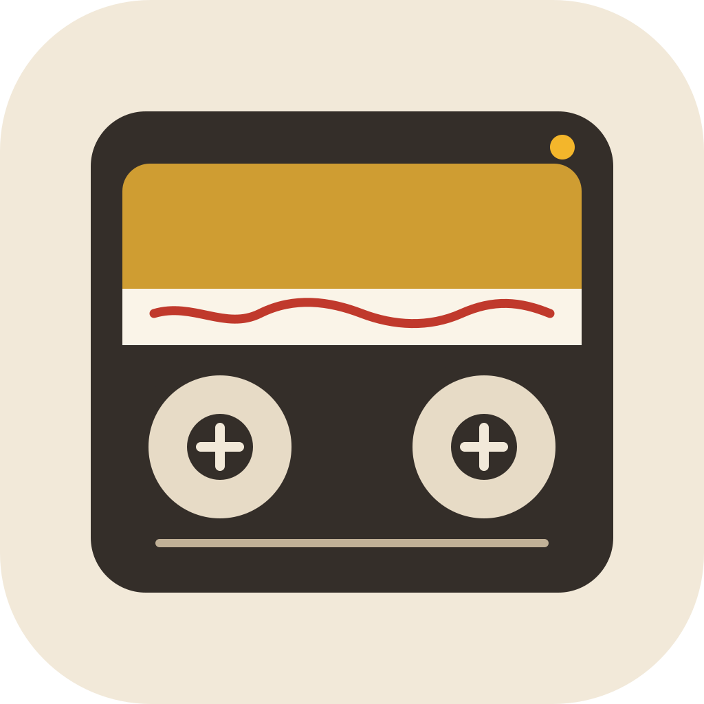
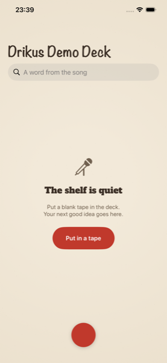
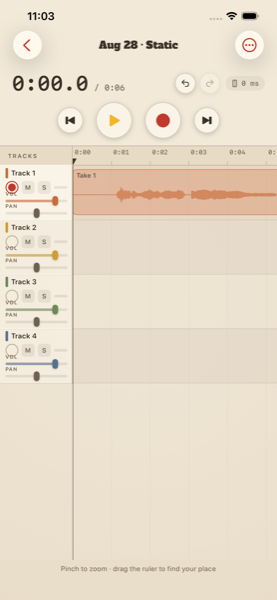
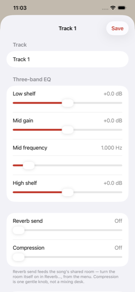

  

<h1 align="center">Drikus Demo Deck</h1>

<strong>Four tracks, as fast as opening Voice Memos.</strong>

For the moment a song shows up and you need it on tape before it leaves again.
Record onto four tracks, overdub without losing the take, and find the song
again later — even if all you remember is one line from the lyrics.

Nothing leaves your phone. No accounts, no uploads, no cloud. Your takes stay
yours.

  
  
  

## Built for actual songwriting, not just voice notes

- Four tracks with arm, volume, pan, mute, solo, and live meters
- Per-track three-band EQ, saved with the session
- Multiple clips per track, gap-accurate — silence stays silence
- Precise overdub timing, compensated for your headphones' real latency,
  with a manual nudge for stubborn gear
- Bounce all four tracks down to one, undoable until your next bounce
- Export to M4A or WAV and share anywhere
- Import audio from Files, or share a Voice Memo straight in
- Pick separate microphone and output devices per session

## Find the song, not just the file

Forty sessions in, "Aug 26 · Marigold" tells you nothing. Search the shelf by
a word from the title, your notes, or anything the phone heard on a take you
asked it to listen to. On-device transcription (iOS 26+) means nothing ever
leaves your phone — it's there to help you find the song, not to write down
the lyrics.

## Get the app

Coming soon to the App Store.

## Support, bugs, and ideas

This repository is the place to reach out about Drikus Demo Deck:

- **Found a bug?** [Open an issue](../../issues/new) and describe what
  happened — the more detail (device, iOS version, what you were doing), the
  faster it's fixable.
- **Have an idea or a feature request?** [Open an issue](../../issues/new) for
  that too — all ideas are welcome, even half-formed ones.
- **Something else?** Check the [existing issues](../../issues) first in case
  someone's already raised it, then open a new one if not.

Every issue gets read. This is a one-person app built by someone who also
needed it, so feedback from people actually using it is what shapes what
happens next.

## Privacy

Nothing leaves your phone, and this app has no accounts, analytics, or
third-party SDKs. See the full [Privacy Policy](PRIVACY.md) for exactly what
the microphone, speech recognition, and location permissions are used for.
